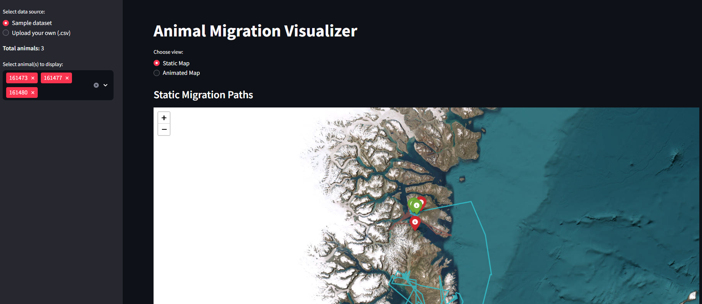
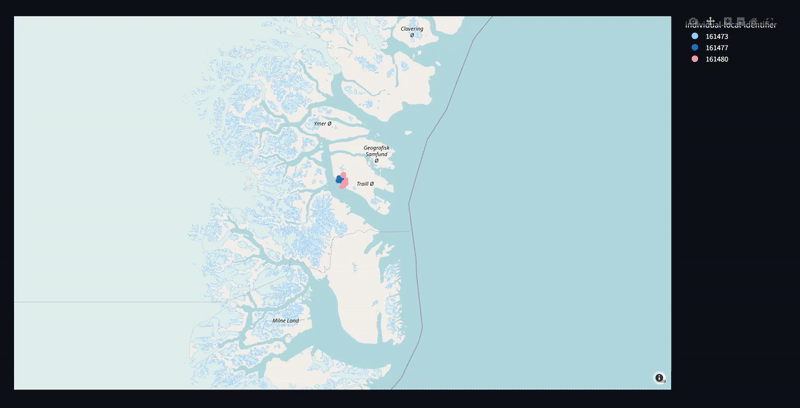

# Migration_Tracker
## What the app does
This streamlit app lets you visualize GPS tracked animal migrations. It comes with an included sample that Artic fox (Vulpes lagopus) from Argos Greenland (Karupelv).

You can download your own CSV file from [Movebank](https://www.movebank.org/)

Check out the app online via [Streamlit](https://migrationtracker-gebpob8zprneqbhnv8rxkm.streamlit.app/)

## Using the app
1. Choose the data
    - Use the build in sample
    - Upload a movebank exported CSV
2. You can select certain subject to follow if there is more than one, or choose one.
3. You can pick your view
    - You can look at the static view
    - or the animated map that shows a timeline with adjustable intervals.

## Dependencies
- All tools that are needed are in the [Requirements text file](requirements.txt)
> streamlit
> 
> pandas
> 
> folium
> 
> streamlit-folium
> 
> matplotlib
> 
> plotly

## Screenshots

## Things I want to do to it.
- [ ] Allow saving maps
- [ ] Heatmap?
